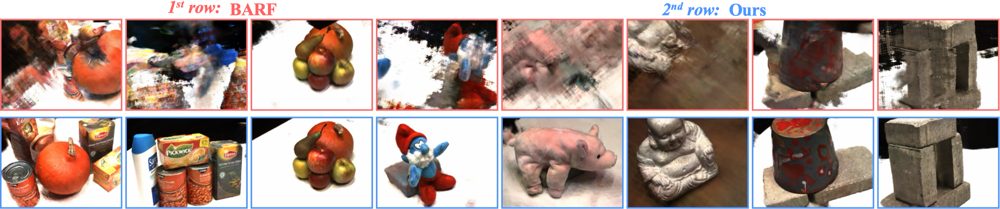
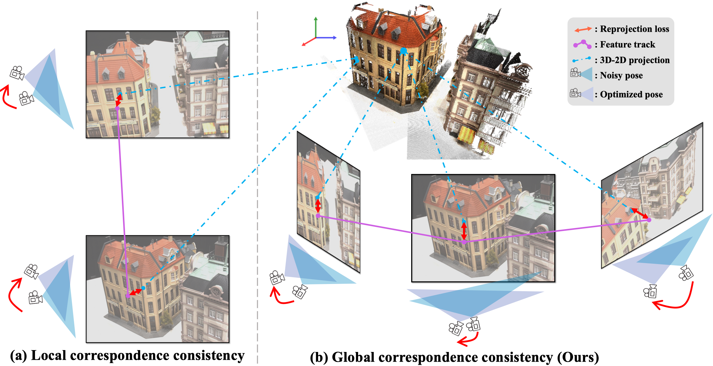

# TrackNeRF: Bundle Adjusting NeRF from Sparse and Noisy Views via Feature Tracks [ECCV'2024]



*This repo contains the official implementation for TrackNeRF paper.* 

[Jinjie Mai](https://scholar.google.com/citations?user=ksCEO0IAAAAJ&hl=en)<sup>1</sup>, 
[Wenxuan Zhu](https://cemse.kaust.edu.sa/ivul/people/person/wenxuan-zhu)<sup>1</sup>, 
[Sara Rojas Martinez](https://scholar.google.com/citations?user=7vnDKiwAAAAJ&hl=en)<sup>1</sup>, 
[Jesus Zarzar](https://scholar.google.com/citations?user=DWis350AAAAJ&hl=en)<sup>1</sup>, 
[Abdullah Hamdi](https://abdullahamdi.com/)<sup>2</sup>, 
[Guocheng Qian](https://guochengqian.github.io/)<sup>3</sup>, 
[Bing Li](https://scholar.google.com/citations?user=xBiftlUAAAAJ&hl=en)<sup>1</sup>, 
[Silvio Giancola](https://www.silviogiancola.com/)<sup>1</sup>, 
[Bernard Ghanem](https://www.bernardghanem.com/)<sup>1</sup>

<sup>1</sup>King Abdullah University of Science and Technology,   <sup>2</sup>Visual Geometry Group,
University of Oxford,  <sup>3</sup>Snap Inc. 


<!-- **Authors: Jinjie Mai et al.
Institute: KAUST et al.** -->


## Citation

Kudos to the great work [SPARF](https://github.com/google-research/sparf) and [PixSfM](https://github.com/cvg/pixel-perfect-sfm), from which we borrow the code and build TrackNeRF upon:
```tex

@inproceedings{lindenberger2021pixsfm,
  author    = {Philipp Lindenberger and
               Paul-Edouard Sarlin and
               Viktor Larsson and
               Marc Pollefeys},
  title     = {{Pixel-Perfect Structure-from-Motion with Featuremetric Refinement}},
  booktitle = {ICCV},
  year      = {2021},
}


@inproceedings{sparf2023,
  title={SPARF: Neural Radiance Fields from Sparse and Noisy Poses},
  author = {Truong, Prune and Rakotosaona, Marie-Julie and Manhardt, Fabian and Tombari, Federico},
  publisher = {{IEEE/CVF} Conference on Computer Vision and Pattern Recognition, {CVPR}},
  year = {2023}
}
```


If you find the code and paper helpful, a citation will be appreciated via:

```tex
@misc{mai2024tracknerfbundleadjustingnerf,
      title={TrackNeRF: Bundle Adjusting NeRF from Sparse and Noisy Views via Feature Tracks}, 
      author={Jinjie Mai and Wenxuan Zhu and Sara Rojas 
          and Jesus Zarzar and Abdullah Hamdi and Guocheng Qian 
          and Bing Li and Silvio Giancola and Bernard Ghanem},
      year={2024},
      eprint={2408.10739},
      archivePrefix={arXiv},
      primaryClass={cs.CV},
      url={https://arxiv.org/abs/2408.10739}, 
}
```

## TODO & News

- [x] Sep 29, 2024: We provide preprocessed keypoints and feature tracks here ( [Google Drive: precomputed_shared_v1.zip](https://drive.google.com/drive/folders/1Wg7T2v-1H2CWhw3lzoPVj_XnWCH9jXyG?usp=sharing) ). Now you can unzip it and put it into `self.precomputed = f'{data_root}/precomputed'` in `source/admin/local_example.py`. So you don't have to run flow net and track keypoint adjustment but use the finetuned ones from us.
- [ ] Release all pretrained checkpoints and models by October.
- [ ] Optimize test-only behavior from existing checkpoints.

## Method


**TL;DR;** We propose to optimize NeRF from sparse and noisy views via feature tracks, which guarantee global correspondence consistency. We introduce TrackNeRF for more globally consistent geometry reconstruction and more accurate pose optimization. TrackNeRF introduces feature tracks, i.e. connected pixel trajectories across all visible views that correspond to the same 3D points. By enforcing reprojection consistency among feature tracks, TrackNeRF encourages holistic 3D consistency explicitly. Through extensive experiments, TrackNeRF sets a new benchmark in noisy and sparse view reconstruction. In particular, TrackNeRF shows significant improvements over the state-of-the-art BARF and SPARF by ∼ 8 and ∼ 1 in terms of PSNR on DTU under various sparse and noisy view setups.


## Datasets

### DTU

<!-- <details>
  <summary><b>DTU</b></summary> -->

* Images: We use the DTU dataset, processed by PixelNeRF, where the images are processed and resized to 300 x 400.
Download the data [here](https://drive.google.com/drive/folders/1PsT3uKwqHHD2bEEHkIXB99AlIjtmrEiR?usp=sharing). 

* Mask Data: For evaluation, we report also masked metrics. For this, we use the object masks provided by DVR, IDR and RegNeRF. [RegNeRF](https://github.com/google-research/google-research/tree/master/regnerf) provides the full mask data (for the test splits), which you can download [here](https://drive.google.com/file/d/1Yt5T3LJ9DZDiHbtd9PDFNHqJAd7wt-_E/view?usp=sharing). 

* Ground-truth depth maps: For evaluation, we report the depth error. For this, we download the [depth maps](https://virutalbuy-public.oss-cn-hangzhou.aliyuncs.com/share/cascade-stereo/CasMVSNet/dtu_data/dtu_train_hr/Depths_raw.zip). They are extracted from [MVSNeRF](https://github.com/apchenstu/mvsnerf#:~:text=training%20data%20and-,Depth_raw,-from%20original%20MVSNet).  

<!-- </details> -->

### LLFF
<!-- <details>
  <summary><b>LLFF</b></summary> -->

The LLFF real-world data can be found in the [NeRF Google Drive](https://drive.google.com/drive/folders/128yBriW1IG_3NJ5Rp7APSTZsJqdJdfc1).
For convenience, you can download them with the following script: (under this repo)
```bash
gdown --id 16VnMcF1KJYxN9QId6TClMsZRahHNMW5g # download nerf_llff_data.zip
unzip nerf_llff_data.zip
rm -f nerf_llff_data.zip
mv nerf_llff_data data/llff
```

<!-- </details> -->


## Installation

* We have tested our code on CUDA 11.7. So first create the environment. And then you need to install some additional dependencies. The first is `cupy-cuda`:

```bash
conda env create -f environment.yml
pip install -r requirements.txt
# cupy version needs to match your CUDA version, we use CUDA 11.7
pip install cupy-cuda117 --no-cache-dir
```


* You will need [PixSfm](https://github.com/cvg/pixel-perfect-sfm) modified by us. You can find our version at [here](https://github.com/Wayne-Mai/PixSfM). To install it and also initialize the external submodules required like DenseMatching and hloc:

```bash
git submodule update --init --recursive
git submodule update --recursive --remote
```

* Then install it into your python environment:
```bash
# make sure you have GCC > 7.0
module load cmake/3.18.4/gcc-7.5.0-mbftn7v 
cd pixsfm
python -m pip install -e .
```


* Optional: The submodule contains lots of unnecessary files. You can suppress them by running
```bash
bash third_party/remove_unused_files.sh
```

* Create source/admin/local.py by running the following command and update the paths to the datasets and workdirs. 
We provide an example admin/local_example.py where all datasets are stored in data/. 
```bash
python -c "from source.admin.environment import create_default_local_file; create_default_local_file()"
```

```python

class EnvironmentSettings:
def __init__(self, data_root='', debug=False, arg_log_dir='logs'):
    # Current date and time
    current_date = datetime.now().strftime("%m-%d-%Y")
    current_time = datetime.now().strftime("%H-%M-%p")

    # Base directory for logs
    base_log_dir = arg_log_dir

    # Create a directory for today's date
    daily_log_dir = os.path.join(base_log_dir, current_date)

    # Create a specific directory for this experiment based on the current time
    experiment_log_dir = os.path.join(daily_log_dir, current_time)

    # Set the directory paths
    self.log_dir = experiment_log_dir
    self.workspace_dir = os.path.join(experiment_log_dir, 'workspace')    # For saving network checkpoints
    self.tensorboard_dir = os.path.join(experiment_log_dir, 'tensorboard')    # For tensorboard files
    self.pretrained_networks = self.workspace_dir    # For saving pre-trained networks
    self.eval_dir = os.path.join(experiment_log_dir, 'eval')    # For saving evaluations

    # Data directories
    if data_root=='':
        self.llff = 'data/nerf_llff_data'
        self.dtu = 'data/rs_dtu_4/DTU'
        self.dtu_depth = 'data/'
        self.dtu_mask = 'data/submission_data/idrmasks'
        self.replica = 'data/Replica'
        self.precomputed = 'data/precomputed'
    else:
        self.llff = f'{data_root}/nerf_llff_data'
        self.dtu = f'{data_root}/rs_dtu_4/DTU'
        self.dtu_depth = f'{data_root}/' # the dataset loader will append /Depth to it
        self.dtu_mask = f'{data_root}/submission_data/idrmasks'
        self.replica = f'{data_root}/Replica'
        self.precomputed = f'{data_root}/precomputed' # precomputed keypoints and feature tracks store location

```

* Download the pre-trained model of [PDC-Net](https://arxiv.org/abs/2101.01710) [here](https://drive.google.com/file/d/1nOpC0MFWNV8N6ue0csed4I2K_ffX64BL/view). You will need to change the path to the pre-trained model in [train_settings/default_config.py](https://github.com/Wayne-Mai/traf_public/blob/master/train_settings/default_config.py) `cfg.flow_ckpt_path` (L.190). 


## Run
### Train
* The installation should have generated a local configuration file `admin/local.py`.  
* Next, set the paths to the training workspace `self.workspace_dir`, i.e. the directory where the model weights and checkpoints will be saved. 
* Set the path to `self.tensorboard_dir`, where the tensorboard files will be stored 
* Set the path to `self.log_dir`, where the logs will be stored
* Set the path to `self.eval_dir`, where the test results will be stored. 
* Also set the paths to the datasets you want to use (and which should be downloaded beforehand, see above). 

* Set the path to the [PDC-Net](https://arxiv.org/abs/2101.01710) pre-trained model (previously downloaded) in train_settings/default_config.py `cfg.flow_ckpt_path`. 


To train it locally, e.g., scene 21 of DTU, run:

```bash
python run_trainval.py joint_pose_nerf_training/dtu tracknerf --train_sub 3 --scene scan21 --plot=True --save_ind_files=True
```
where `joint_pose_nerf_training` means joint optimization of NeRF and noisy pose, `train_sub` means number of views, `tracknerf` means the config file in `train_settings/joint_pose_nerf_training/<tracknerf.py>`.

### Validation

If you want to load a pretrained checkpoint to re-do validation, run:


```bash
# Selecting <train_module> <train_name> <nbr_input_views> <scene_name>
# to regenerate the test metrics 
python run_trainval.py <train_module> <train_name> --train_sub <nbr_input_views> --scene <scene_name> --test_metrics_only True 

# to regenerate the video of the renderings
python run_trainval.py <train_module> <train_name> --train_sub <nbr_input_views> --scene <scene_name> --render_video_only True 

# Selecting <ckpt_dir> <out_dir> <expname> to perform test metrics
python eval.py --ckpt_dir <ckpt_dir> --out_dir <out_dir> --expname <expname> --plot True --save_inds_file True
```


## Documentation


### Track based Keypoint Adjustment

We follow Pixel Perfect SfM to perform feature-metric keypoint adjustment.
That is, after we get the keypoint correspondence from matcher,
we optimize the 2D keypoints location to finetune the accuracy of correspondence.

The keypoint extraction code is unchanged from SPARF, with PDC-Net as the matcher.
The keypoint refinement code is adapted from Pixel SfM,
you can find the function `refine_keypoints()` in `source/training/base_corres_loss.py` and `source/training/base_track_loss.py`.


To enable it with track loss proposed by us, in `train_settings/joint_pose_nerf_training/<your_config.py>`, set `settings_model.track.precompute_ka_for_track_loss=True` and `settings_model.loss_type = 'photometric_and_track_and_depth_reg'`.

### Track based Loss

We propose to calculate the reprojection loss in the feature track scope.

To enable it in the training, in `train_settings/joint_pose_nerf_training/<your_config.py>` set `settings_model.loss_type = 'photometric_and_track`, which means we are using photometric rendering loss and track reprojection loss.


The implementation is in `source/training/core/base_track_loss.py` and `source/training/core/track_graph.py`.


### Depth Smoothness loss

The depth smoothness loss encourages the image gradient align with depth gradient, which is implemented in `source/training/core/base_depth_reg_loss.py`.
You can now enable it by set `settings_model.loss_type = 'photometric_and_track_and_depth_reg`, which means we are using photometric rendering loss, track loss and depth regularization loss.
### Code structure
The framework in `source/` consists of the following sub-modules.

* training: 
    * core: the losses, sampling strategy and metric files
    * engine: Classes for main training routine 
    * base.py: Base class for the NeRF/pose trainer. All the others inherit from it. 
    * **nerf_trainer.py**: The main engine for training a NeRF model, considering **fixed ground-truth poses**. Only the NeRF model is optimized. It inherits base.py. 
    * **joint_pose_nerf_trainer.py**: The main engine for training of the NeRF model jointly with refining initial noisy camera poses. This corresponds to SPARF's main use case. Optimized are the NeRF model and the camera pose estimates. It inherits nerf_trainer.py. 
    * **nerf_trainer_w_fixed_colmap_poses.py**: The main engine for training a NeRF model, considering fixed poses, obtained from COLMAP (or some other initialization). The poses are therefore most likely noisy. Only the NeRF model is optimized. This is to show comparison to the joint refinement.  It inherits nerf_trainer.py. 
* train_settings: Contains config files, specifying the training of a network. For each experiment, we create a new config file in train_settings. The logging and saving will adapt accordingly so only the config file needs to be created in train_settings. 
* admin: Includes functions for loading networks, tensorboard etc. and also contains environment settings.
* datasets: Contains integration of a number of datasets. All datasets inherent from the base Dataset class in datasets/base.py
* utils: Contains functions for logging, visualizations, geometric operations and colmap initalization. 
    * geometry: Utils for geometric transformations 
    * colmap_initialization: Utils to initializes poses with COLMAP, run with different matchers
* models: Contains NeRF model definition, different pose parametrization and the correspondence network wrapper. 


## License
This code is licensed under the Apache 2.0 License. See [LICENSE](https://github.com/google-research/sparf/blob/main/LICENSE) for more details.


